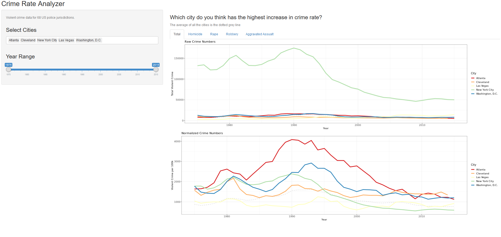
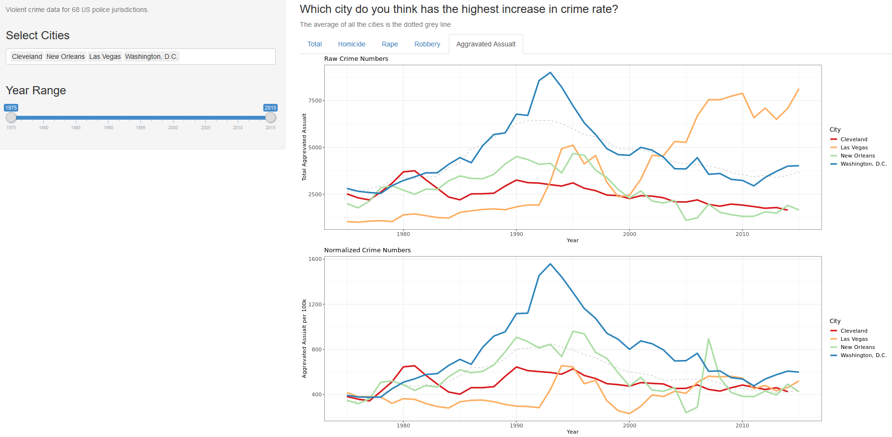

```{r setup, include=FALSE}
knitr::opts_chunk$set(echo = FALSE)
library(tidyverse)
library(ggthemes)
library(dplyr)
```

## Introduction  

Moving to a new place in the U.S. is already a stressful experience, let alone moving to a whole new city. Therefore, your own safety is the last thing you want to worry about when you arrive. 

What you need is a way to compare crime rates of potential cities in the U.S. to facilitate your final decision. Let say you are a college graduate student and is looking to apply for jobs in the United States of America. You are trying to narrow your research based on the crime profiles of various major cities and select the ones with the lowest crime rates. 

When this app and this interactive map are used, you will be able interact with the data by selecting the cities and the time period over which you want to analyze the cities’ total crime rate. You would also want to know the some specific types of crime and investigate each type of crime separately with the second tool. 

By looking at the data over a time period, you can come to your own conclusion of whether that city has become safer or riskier over time and by exploring individual crimes in his candidate cities, or you can raise your alert of only certain crimes you want to safeguard against. Life can be too dangerous out there. So inspired from this idea, this will be a data visualization app that individuals can use to gain further insight into the violent crime rates of US cities. Taken data for 68 US cities between 1975-2015, I believe This application allow users to pick multiple cities at a time so they compare raw and normalized crime numbers. The user can also limit the time period and compare specific categories of violent crime. The interactive map, on the other hand, will find cities with the highest crime rates for every state from data set in 2018 and and show them on the U.S. map. Depends on the value of the crime rate, the radius will correllate.

## Interactive Map (U.S. cities with highest crime rates)  (2018)

```{r, message =FALSE, echo=FALSE}

offenceReportUrl <- "https://ucr.fbi.gov/crime-in-the-u.s/2018/preliminary-report/tables/table-4/table-4.xls"
geoPositionsUrl <- "https://www.downloadexcelfiles.com/sites/default/files/docs/lat-long-cities-usa-1507j.xlsx"

# install.packages("readxl")
library("readxl")

offenceReportFileName <- URLdecode(offenceReportUrl) %>% basename()
geoPositionsFileName <- URLdecode(geoPositionsUrl) %>% basename()

# read files
dataset <- read_excel(offenceReportFileName, skip=4)
GeoLocationData <- read_excel(geoPositionsFileName)

## ----- DATA WRANGLING ----- ##

colnames(dataset)[3] <- "Year"
colnames(dataset)[4] <- "Population"
colnames(dataset)[5] <- "Violent_Crimes"


#install.packages("dplyr")
library(dplyr)

dataset <- select(filter(dataset, Year == 2017), c(State, City, Year, Population, Violent_Crimes))

stateList <- dataset$State

notEmptyName <- "foobar"
for(i in 1 : length(stateList)) {
  if(!is.na(stateList[i])) {
    notEmptyName <- stateList[i]
  } else {
    stateList[i] <- notEmptyName
  }
}

dataset$State <- stateList

tidydataset <- dataset

## ----- END ----- ##

## ----- Find cities with the highiest crime rate ----- ##

# Calculate crime rate for every city
tidydataset$Crime_Rate <- tidydataset$Violent_Crimes / tidydataset$Population

# find the most crime city in every state
tidydataset <- merge(aggregate(Crime_Rate ~ State, tidydataset, max), tidydataset, by = c("Crime_Rate"))

tidydataset <- subset(tidydataset, select = -c(3)) 
tidydataset <- tidydataset[,c(2, 3, 4, 1, 5)]
colnames(tidydataset)[1] <- "State"

# sort by crime rate
tidydataset <- tidydataset[order(-tidydataset$Crime_Rate), ]


# becuz reference numbers in the report -> get rid of them
tidydataset$City <- replace(as.character(tidydataset$City), tidydataset$City == "NEW ORLEANS7", "NEW ORLEANS")
tidydataset$City <- replace(as.character(tidydataset$City), tidydataset$City == "HONOLULU5", "HONOLULU")
tidydataset$City <- replace(as.character(tidydataset$City), tidydataset$City == "HOUSTON5", "HOUSTON")
tidydataset$City <- replace(as.character(tidydataset$City), tidydataset$City == "NASHVILLE METROPOLITAN", "NASHVILLE")

crimeRatesDataFrame <- tidydataset

## ----- END ----- ##

## ----- Match names of the states and cities in the dataset with the names of them in the geo data set ----- ##

GeoLocationData$State <- toupper(GeoLocationData$State)
GeoLocationData$City <- toupper(GeoLocationData$City)

# merge two data sets
crimeRatesDataFrame <- merge(crimeRatesDataFrame, GeoLocationData, by = c("State", "City"))

# split geo coordinates
splitGeo <- data.frame(do.call('rbind', strsplit(as.character(crimeRatesDataFrame$Location),' ',fixed=TRUE)))
colnames(splitGeo) <- c('Latitude', 'Longitude')

# extract geologic coordinates
# install.packages("stringr")
library("stringr")

splitGeo$Latitude <- as.numeric(str_extract(splitGeo$Latitude, "\\d+\\.*\\d*"))
splitGeo$Longitude <- 0 - as.numeric(str_extract(splitGeo$Longitude, "\\d+\\.*\\d*"))

crimeRatesDataFrame <- cbind(crimeRatesDataFrame, splitGeo)

CrimeRatessf <- crimeRatesDataFrame

## ----- END ----- ##

## ----- SHOW DATA ON MAP ----- ##

#install.packages('leaflet')
library(leaflet)

map <- leaflet() %>% addTiles()
map <- map %>% 
    addMarkers(lat = CrimeRatessf$Latitude, 
               lng = CrimeRatessf$Longitude, 
               popup = paste(CrimeRatessf$City,
                             "<br>State: ", formatC(CrimeRatessf$State),
                             "<br>Population, people: ", formatC(CrimeRatessf$Population, format = "d", big.mark = ","),
                             "<br>Crime rate, per 100k people: ", formatC(CrimeRatessf$Crime_Rate * 100000, format = "d", big.mark = ",")
                             )
               ) %>%
    addCircles(lat = CrimeRatessf$Latitude,
               lng = CrimeRatessf$Longitude,
               weight = 1, 
               radius = CrimeRatessf$Crime_Rate * 2 * 10^7,
              )
map # show the map

## ----- END ----- ##
```

Looking at this map, the data seems to be accurate as crimes usually appear more in larger cities areas, such as those cities near DC or NYC. This came as no surprise to me. What did surprise me , though, and what I personally got from this is that even though you may think some cities are safe, such as Cleveland where I am living now, falls into one of the cities with the highest crime rate in Ohio state. I wonder how many more people may feel unsafe after they have access to this kind of information about their State.


## Interactive app (Crime Rate in U.S. cities 1975 - 2015)



## Discusssion

Overall, I would say generally violent crime in the U.S. has fallen sharply over the past few decades. This claim can also be backed up by data of crime statistics in the U.S from [these two sources](https://www.bjs.gov/content/pub/pdf/ntcm_2014.pdf), a substantial decline in the violent crime rate is shown after its peak in the early 1990s. This can be seen clearest in Atlanta city. The former is a yearly report by the FBI of serious crimes reported to police around the country. The other is a nationally representative annual survey on approximately 160,000 Americans ages 12 and older by the BJS (Bureau of Justice Statistics) to see if they were victims of crime, whether they reported those crimes to the police or not.

The long-term decline in violent crime is not by any means, uninterrupted though. Let's look at another type of crime violence.




Look at Las Vegas and Washington DC, for instance, there are still decent increases in the assault rate between 2013 - 2015. Regardless of what the data showed us, I still believe there is still more to the picture. It's not like most crimes are reported to police, and most reported crimes are solved. The 2018 survey from BJS showed less than half of violent crimes were actually reported to police. I guess some people might just have the feeling that police “would not or could not do anything to help” or that the crime is “a personal issue or too trivial to report”.

There are still a lot of things can be said about the app, and with other crime categories, but I will let you find it out in your own time.

## Methodology

* When I made this, my main goal is to keep things simple and focus on legibility. 
* Since the data for each city was chronological, it is most intuitive to visualize this time-series data as a line-chart. The colors chosen to contrast the two cities were from a colorblind friendly palette, making the user interface more accessible. 
* To allow for a fair comparison, there is a line graph for both the raw and normalized crime numbers per 100000 to adjust for the differences in the populations between the two cities.
* I also go for the map interface for to make user interface more friendly.
* Apart from the `Total` violent crimes, four other tabs for , `Homicide`, `Rape`, `Robbery`, and `Aggravated Assault` provide more varieties for the user.
* The side panel filter allows the user to filter the crime data down to specific years.
* Users can have access to both raw and normalized crime numbers line plots based on the currently selected tab
* The plot legends would update to show the selected cities in different colors for users to follow.  
* I also provided graph title's to express the difference between the two graphs and small texts to explain the graph and the app better.


